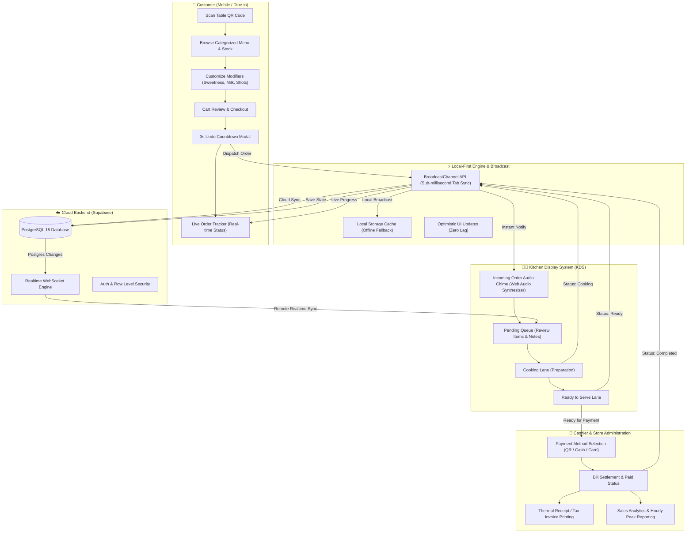

# 🍽️ QR Menu & Easy Order

> Modern, zero-install Web Application for smart restaurant and cafe ordering.
>
> 🌐 **Live Demo:** [https://zillerdx.github.io/QR-Menu-Easy-Order/](https://zillerdx.github.io/QR-Menu-Easy-Order/)

---

## 📌 Project Overview

**Easy Menu & Easy Order** is a responsive, local-first restaurant management and dine-in web application. It connects customer self-ordering with back-of-house kitchen operations in real time without requiring any app downloads or app-store installs.

* **Customer Dine-In & Takeaway:** Browse visual menus, customize orders (sweetness, milk alternatives, extra shots, toppings), and track live cooking status in real time.
* **Flexible Payments:** Integrated Thai QR (PromptPay EMVCo with CRC16 checksum), Cash at counter, and Credit Card options with thermal receipt and full tax invoice printing.
* **Kitchen Display System (KDS):** Symmetrical 4-lane ticket board with Web Audio harmonic sound alert synthesizer, live KPI counters, date filtering (Today, Yesterday, Past 7 Days, Custom Date), and automatic new-day refresh.
* **Menu & Store Admin:** Manage menu items with direct image uploads, customize categories with 29 curated vector icons, toggle live stock availability, and configure store branding.
* **Table QR Generator:** Generate and print high-resolution branded table stand QR cards with store routing protection.
* **Staff Authentication:** Secure Supabase Auth with password recovery for authorized store portal access.

---

## 🔄 System Flow & Swimlane Architecture



---

## 🛠️ Tech Stack

| Layer | Technologies |
| :--- | :--- |
| **Frontend** | React 18, TypeScript, Vite 6 |
| **Styling & UI** | Tailwind CSS 3.4, Lucide React icons, Canvas Confetti |
| **Realtime & Sync** | BroadcastChannel API (tab sync), LocalStorage (offline cache), Supabase Realtime |
| **Backend & DB** | Supabase (PostgreSQL 15, Auth, Row-Level Security) |
| **Audio** | Web Audio API (6 customizable harmonic chime presets) |
| **Testing** | Vitest 4.1, Testing Library, JSDOM (10 test suites, 38 passing tests) |
| **CI/CD & Hosting** | GitHub Actions ➔ GitHub Pages |

---

## 🚀 Performance & Architectural Highlights

1. **Local-First & Resilient Sync:** Uses `BroadcastChannel` for zero-latency multi-tab event communication and falls back to `LocalStorage` and Supabase Realtime WebSockets.
2. **Eliminated Storage & Polling Churn:** Background fallback polling is throttled to 15s and only runs when tab is visible (`!document.hidden`), checking content hashes before triggering state updates.
3. **Optimized KDS Render Performance:** All order filters and date checks are memoized with `useMemo`, preventing redundant `new Date()` allocations and isolating 30s timers to active tickets only.
4. **Zero-Stuck Number Inputs:** Custom price delta inputs in admin modals gracefully handle empty values on backspace without locking at `0`.
5. **Clean Vector Design System:** 100% vector iconography using Lucide SVGs without Unicode emoji clutter in production interfaces.

---

## 📂 Annotated Folder Tree

```text
qr-menu-app/
├── public/                     # Static assets, official favicons & brand logos
│   ├── favicon.ico             # Multi-size legacy browser favicon
│   ├── favicon.svg             # Vector brand favicon for modern browsers
│   └── apple-touch-icon.png    # iOS bookmark icon (180x180)
├── src/
│   ├── assets/                 # Brand assets & default imagery
│   ├── components/             # Modular React UI components
│   │   ├── admin/              # Menu management, category editor & store settings
│   │   ├── common/             # Shared components (Header, Receipt, RoleSwitcher, Modals)
│   │   ├── customer/           # Customer views (CartDrawer, ItemModal, OrderTracker, MenuCard)
│   │   ├── kitchen/            # KDS dashboard, OrderCard, StockManager, Analytics & Modals
│   │   ├── portal/             # Store portal login & password reset flows
│   │   └── table-qr/           # Printable table QR stand card generator
│   ├── data/                   # Initial mock data & logo constants
│   ├── types/                  # TypeScript interfaces (Order, MenuItem, Category, Config)
│   ├── utils/                  # Core services & utilities
│   │   ├── categoryIcons.tsx   # 29 curated food & beverage Lucide icons
│   │   ├── i18n.ts             # Bilingual translations (TH/EN)
│   │   ├── promptpay.ts        # EMVCo PromptPay QR payload generator & CRC16 checksum
│   │   ├── sound.ts            # Web Audio chime synthesizer (6 presets)
│   │   ├── storage.ts          # RealtimeSyncManager (BroadcastChannel + LocalStorage)
│   │   ├── supabaseClient.ts   # Supabase client initialization & auth helpers
│   │   └── taxInvoice.ts       # Thermal receipt & tax calculation helpers
│   ├── App.tsx                 # Root application controller & realtime event subscriptions
│   ├── index.css               # Global styles & Tailwind CSS directives
│   └── main.tsx                # Application bootstrap entry point
├── tests/                      # Automated test suite (Vitest + JSDOM)
│   ├── authForgotPassword.test.ts # Auth & password reset test cases
│   ├── categoryIcons.test.ts   # Category icon dictionary validation
│   ├── comprehensiveAudit.test.ts # Storage, tax calculation & promptpay validation
│   ├── favicon.test.ts         # Favicon link tags & assets
│   ├── i18n.test.ts            # Translation dictionary completeness
│   ├── kdsDateFilter.test.ts   # KDS date filtering & revenue scoping
│   ├── orderFlow.test.ts       # Order lifecycle & status transitions
│   ├── paymentMethods.test.ts  # Payment method selection & bill closing
│   ├── promptpay.test.ts       # EMVCo QR code payload & CRC16 checks
│   └── taxInvoice.test.ts      # Thermal slip formatting & tax math
├── index.html                  # HTML shell & SEO/PWA meta headers
├── package.json                # Project dependencies & scripts
├── tailwind.config.js          # Tailwind CSS theme & plugin config
└── vite.config.ts              # Vite configuration & chunk splitting
```

---

## ⚡ Commands

```bash
# 1. Install dependencies
npm install

# 2. Start local development server
npm run dev

# 3. Run automated test suite (Vitest)
npm test

# 4. Build production bundle with TypeScript type-checking
npm run build

# 5. Preview production build locally
npm run preview
```

