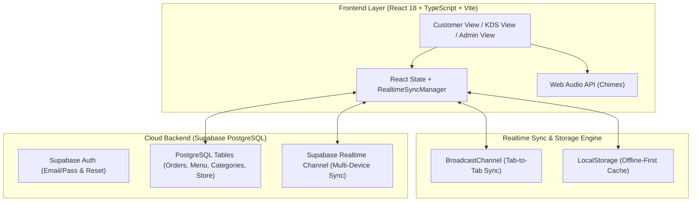

# 🍽️ Easy Menu & Easy Order (ระบบสั่งอาหารและจัดการร้านอัจฉริยะ)

[](https://vitejs.dev/)
[](https://reactjs.org/)
[](https://www.typescriptlang.org/)
[](https://tailwindcss.com/)
[](https://supabase.com/)
[-green?logo=vitest&logoColor=white)](https://vitest.dev/)
[](LICENSE)

> 🚀 **Live Interactive Web App:** 👉 [https://zillerdx.github.io/QR-Menu-Easy-Order/](https://zillerdx.github.io/QR-Menu-Easy-Order/)

**Easy Menu & Easy Order** คือระบบสั่งอาหารผ่าน QR Code และจัดการร้านอาหาร/คาเฟ่อัจฉริยะแบบไร้รอยต่อ (Zero-Install Progressive Web Solution) ออกแบบมาเพื่อยกระดับการให้บริการของร้านอาหารและคาเฟ่ยุคใหม่ ลูกค้าสามารถสแกน QR ประจำโต๊ะเพื่อดูเมนู ปรับแต่งท็อปปิ้ง สั่งอาหาร ชำระเงินผ่านพร้อมเพย์/เงินสด/บัตรเครดิต และติดตามสถานะอาหารได้แบบเรียลไทม์ พร้อมหน้าจอ **Kitchen Display System (KDS)** สำหรับห้องครัว, ระบบจัดการเมนู/สต็อก และระบบจัดการแบรนด์ร้านค้าอย่างสมบูรณ์แบบ

---

## 🌟 จุดเด่นและฟีเจอร์หลัก (Core Features)

### 1. 📱 ระบบสั่งอาหารสำหรับลูกค้า (Customer Dine-in & Takeaway)
* **ไม่ต้องติดตั้งแอป (Zero App Download):** ใช้งานได้ทันทีผ่าน Browser บนสมาร์ทโฟนทุกระบบ (iOS, Android, Tablet, PC)
* **รองรับทั้งทานที่ร้านและสั่งกลับบ้าน:** สแกน QR โต๊ะ หรือระบุหมายเลขโต๊ะได้แบบยืดหยุ่น (รวมถึงออเดอร์กลับบ้าน / Takeaway)
* **ค้นหาและจัดหมวดหมู่อัจฉริยะ:** แสดงไอคอนหมวดหมู่เฉพาะทาง 29 รูปแบบ (กาแฟ, ชา, เบเกอรี่, ของทานเล่น ฯลฯ) พร้อมระบบค้นหาแบบ Real-time
* **ปรับแต่งตัวเลือกละเอียด (Customization Engine):** เลือกระดับความหวาน, ประเภทนม (Oat, Almond, Soy), เพิ่มช็อตกาแฟ และท็อปปิ้ง พร้อมคำนวณราคาสุทธิอัตโนมัติ
* **นับถอยหลังยืนยันออเดอร์ (10s Review Modal):** ให้เวลาลูกค้าตรวจสอบความถูกต้อง 10 วินาทีก่อนส่งเข้าครัว พร้อมปุ่มยกเลิกหรือแก้ไขได้ทันใจ
* **ติดตามสถานะอาหารแบบสด (Live Order Tracker):** แสดงสถานะแบบ Stepper (`รอดำเนินการ` ➔ `กำลังปรุง` ➔ `พร้อมเสิร์ฟ` ➔ `เสร็จสิ้น`)
* **สลับภาษาทันที (Bilingual EN/TH):** รองรับภาษาไทยและภาษาอังกฤษ พร้อมบันทึกการตั้งค่าลงเครื่อง

### 2. 💳 ระบบการชำระเงินหลายช่องทาง (Multi-Method Payments)
* **Thai QR Payment (PromptPay):** สร้าง QR Code พร้อมเพย์มาตรฐาน EMVCo แบบไดนามิกตามยอดเงินจริง สแกนจ่ายผ่าน Mobile Banking ได้ทันที
* **รองรับเงินสด (Cash) และบัตรเครดิต (Credit Card):** เพิ่มทางเลือกการชำระเงินที่เคาน์เตอร์ได้ทั้ง 3 รูปแบบ
* **บันทึกวิธีชำระเงินตอนปิดบิล:** แสดงสถานะการชำระเงินในระบบ KDS และบันทึกวิธีชำระเงินอย่างถูกต้อง
* **พิมพ์ใบเสร็จ/ใบกำกับภาษี (Thermal Receipt Printing):** หน้าต่างพิมพ์ใบเสร็จที่จัดรูปแบบให้พอดีกับเครื่องพิมพ์ความร้อน (Thermal 80mm / 58mm) และกระดาษทั่วไป

### 3. 🍳 จอควบคุมห้องครัวอัจฉริยะ (Kitchen Display System - KDS)
* **ระบบ 4 แท็บสถานะแบบสมมาตร (100% Symmetrical Segmented Tabs):**
  * `🍴 รอปรุง / กำลังทำ` (Pending & Cooking)
  * `✨ พร้อมเสิร์ฟ` (Ready to Serve)
  * `⏱️ เสร็จสิ้น / ปิดบิล` (Completed & Closed Bills)
  * `🥞 ออเดอร์ทั้งหมด` (All Orders)
* **ดีไซน์สะอาดตาไร้แสงฟุ้ง (Clean Anti-Glare UI):** ปรับปุ่มแท็บให้คมชัด สมมาตรทุกขนาดหน้าจอ ไม่มีแสงเรืองสะท้อนรบกวนสายตา
* **แถบตัวกรองวันที่อัจฉริยะ (Date Filter Toolbar):**
  * `[📅 วันนี้]` (Today - ค่าเริ่มต้น)
  * `[เมื่อวาน]` (Yesterday)
  * `[7 วันล่าสุด]` (Past 7 Days)
  * `[ประวัติทั้งหมด]` (All Time)
  * `[📆 เลือกวันที่]` (Custom Date Picker `YYYY-MM-DD`)
* **ระบบรีเฟรชข้อมูลอัตโนมัติเมื่อขึ้นวันใหม่ (Auto-Refresh on New Day):** ตรวจจับการเปลี่ยนผ่านของวันและดีดตัวกรองกลับมาเป็น "วันนี้" อัตโนมัติ เพื่อไม่ให้ออเดอร์ที่ปิดบิลแล้วของเมื่อวานมาค้างในหน้าครัว
* **ปุ่มรีเฟรชแบบ Manual:** พร้อมตัวบอกเวลาอัปเดตล่าสุด (`อัปเดต HH:mm:ss`)
* **KPIs ยอดขายและจำนวนบิล:** คำนวณยอดขายรวมและจำนวนบิลตามช่วงเวลาที่เลือกแบบ Dynamic
* **ระบบเสียงแจ้งเตือน (Web Audio API):** เล่นเสียงกระดิ่งเมื่อมีออเดอร์ใหม่ พร้อมเมนูทดสอบเสียงและเลือกพรีเซ็ตเสียงได้
* **ระบบจัดการสต็อกเรียลไทม์ (Stock Manager):** สลับเปิด/ปิดสินค้าหมดได้ทันที พร้อมปุ่มเติมสต็อกทั้งหมวดหมู่

### 4. 🔐 ระบบเข้าสู่ระบบและพอร์ทัลร้านค้า (Authentication & Portal)
* **ระบบล็อกอินด้วยอีเมลและรหัสผ่าน:** ป้องกันการเข้าถึงส่วนควบคุมสำหรับผู้ดูแลและพนักงาน
* **หน้า Portal แรกเข้า:** สำหรับร้านที่ยังไม่ได้เข้าสู่ระบบ พร้อมระบบแยกบทบาท Staff/Owner
* **ระบบขอรีเซ็ตรหัสผ่าน (Forgot Password):** ส่งคำขอรีเซ็ตรหัสผ่านทางอีเมลผ่าน Supabase Auth
* **หน้าต่างเปลี่ยนรหัสผ่านใหม่ (Update Password):** รองรับ Recovery Token และอัปเดตรหัสผ่านใหม่อย่างปลอดภัย
* **ป๊อปอัปยืนยันการออกจากระบบ (Logout Confirm Modal):** ป้องกันการกดออกจากระบบโดยไม่ตั้งใจ

### 5. 📋 ระบบจัดการเมนูและหมวดหมู่ (Menu & Category Admin)
* **ตัวเลือกไอคอนหมวดหมู่ 29 รายการ (Dynamic Category Icon Picker):** มีไอคอน Vector คมชัดครอบคลุมอาหาร เครื่องดื่ม เบเกอรี่ และของหวาน
* **เพิ่ม/แก้ไข/ลบเมนูแบบครบวงจร:** อัปโหลดรูปภาพเมนูจากเครื่องโดยตรง (PNG, JPG, WebP) หรือใส่ URL ภาพ
* **กำหนดตัวเลือกเสริม (Option Groups):** กำหนดระดับความหวาน ขนาดแก้ว ท็อปปิ้ง และราคาบวกเพิ่มได้อิสระ

### 6. ⚙️ ระบบตั้งค่าร้านค้าและสร้าง QR โต๊ะ (Store Settings & Table Stand)
* **ปรับแต่งแบรนด์ร้าน:** อัปโหลดโลโก้ร้าน, กำหนดชื่อร้านภาษาไทย/อังกฤษ, สโลแกน, และข้อมูลพร้อมเพย์
* **ระบบ Favicon มาตรฐาน:** มีชุดไอคอนเบราว์เซอร์ครบครัน (ICO, SVG, PNG 16/32/64/180/192/512)
* **ตัวสร้างการ์ด QR ประจำโต๊ะ (Table QR Generator):** สั่งพิมพ์การ์ดตั้งโต๊ะพร้อมโลโก้ร้านและเลขโต๊ะ สแกนทดสอบได้ทันที

---

## 🚀 ลิงก์สำหรับทดสอบระบบ (Live Demo Navigation)

| หน้าการทำงาน | บทบาท (Role) | URL สำหรับทดสอบ |
| :--- | :--- | :--- |
| **ลูกค้าสั่งอาหาร (โต๊ะ 01 - ภาษาอังกฤษ)** | ลูกค้าทั่วไป | [👉 เปิดโต๊ะ 01 (EN)](https://zillerdx.github.io/QR-Menu-Easy-Order/?table=01&lang=en) |
| **ลูกค้าสั่งอาหาร (โต๊ะ 05 - ภาษาไทย)** | ลูกค้าทั่วไป | [👉 เปิดโต๊ะ 05 (TH)](https://zillerdx.github.io/QR-Menu-Easy-Order/?table=05&lang=th) |
| **ลูกค้าสั่งกลับบ้าน (Takeaway)** | ลูกค้าสั่งกลับบ้าน | [👉 สั่งกลับบ้าน](https://zillerdx.github.io/QR-Menu-Easy-Order/?table=TAKEAWAY&lang=th) |
| **จอครัว KDS (Kitchen Display)** | ฝ่ายบริการ/พ่อครัว | [👉 เปิดจอ KDS](https://zillerdx.github.io/QR-Menu-Easy-Order/?role=kitchen) |
| **ระบบจัดการเมนูและหมวดหมู่** | เจ้าของร้าน/ผู้จัดการ | [👉 จัดการเมนู](https://zillerdx.github.io/QR-Menu-Easy-Order/?role=admin) |
| **ตั้งค่าร้านค้าและแบรนด์** | เจ้าของร้าน | [👉 ตั้งค่าร้าน](https://zillerdx.github.io/QR-Menu-Easy-Order/?role=settings) |
| **สร้างและพิมพ์การ์ด QR โต๊ะ** | พนักงานบริการ | [👉 พิมพ์ QR โต๊ะ](https://zillerdx.github.io/QR-Menu-Easy-Order/?role=qr) |

---

## 🏗️ สถาปัตยกรรมระบบ (Architecture & Tech Stack)



### รายละเอียดเทคโนโลยี
* **Frontend Framework:** React 18 (Hooks, Suspense, Lazy Loading)
* **Language:** TypeScript 5.7+ (Strict Type-checking)
* **Styling & UI:** Tailwind CSS 3.4, Lucide React (Vector Iconography)
* **Build Tool:** Vite 6
* **Database & Cloud:** Supabase (PostgreSQL 15, Row Level Security, Realtime CDC Streams)
* **Testing:** Vitest 4.1, JSDOM, React Testing Library
* **CI/CD & Hosting:** GitHub Actions ➔ GitHub Pages

---

## 🗄️ โครงสร้างฐานข้อมูล (Database Schema Overview)

ระบบเชื่อมต่อกับ Supabase PostgreSQL โดยมีตารางหลักดังนี้:

1. **`orders`**: จัดเก็บรายการออเดอร์ สถานะ (`pending`, `cooking`, `ready`, `completed`, `cancelled`), ยอดเงิน, วิธีชำระเงิน (`promptpay`, `cash`, `credit_card`), และสถานะการชำระเงิน
2. **`menu_items`**: จัดเก็บรายการอาหาร ราคา รายละเอียด รูปภาพ หมวดหมู่ ตัวเลือกเสริม (Option Groups) และสถานะสต็อก (`is_available`)
3. **`categories`**: จัดเก็บหมวดหมู่อาหาร ชื่อไทย/อังกฤษ และชื่อไอคอน Lucide
4. **`store_config`**: จัดเก็บข้อมูลร้านค้า โลโก้ เลขพร้อมเพย์ จำนวนโต๊ะ และเวลาทำการ

---

## 💻 การติดตั้งและรันในเครื่อง (Local Development Setup)

### ข้อกำหนดเบื้องต้น (Prerequisites)
* Node.js 18.0.0 หรือสูงกว่า
* npm 9.0.0 หรือสูงกว่า

### ขั้นตอนการรัน
```bash
# 1. Clone Repository
git clone https://github.com/ZillerDX/QR-Menu-Easy-Order.git
cd QR-Menu-Easy-Order

# 2. ติดตั้ง Dependencies
npm install

# 3. รัน Dev Server สำหรับทดสอบ
npm run dev

# 4. รันชุดทดสอบอัตโนมัติ (Automated Tests)
npm test

# 5. สั่ง Build สำหรับ Production
npm run build
```

---

## 🧪 การทดสอบระบบ (Quality Assurance & Testing)

ระบบมีชุดทดสอบครอบคลุมทั้ง Unit Tests และ Integration Tests รวม **38 การทดสอบ จาก 10 ชุดทดสอบ (Passing 100%)**:

* `tests/kdsDateFilter.test.ts` — ทดสอบการกรองวันที่ของ KDS และการคำนวณยอดขายตามช่วงเวลา
* `tests/categoryIcons.test.ts` — ตรวจสอบระบบไอคอนหมวดหมู่ทั้ง 29 รายการ
* `tests/paymentMethods.test.ts` — ทดสอบการชำระเงินด้วย PromptPay, Cash, และ Credit Card
* `tests/taxInvoice.test.ts` — ทดสอบการคำนวณภาษีและพิมพ์ใบเสร็จ
* `tests/promptpay.test.ts` — ตรวจสอบความถูกต้องของ EMVCo Payload และ CRC16 Checksum
* `tests/authForgotPassword.test.ts` — ทดสอบกระบวนการรีเซ็ตรหัสผ่านและการเปลี่ยนรหัสผ่าน
* `tests/favicon.test.ts` — ตรวจสอบความถูกต้องของไฟล์ไอคอนและ Metadata ใน index.html
* `tests/orderFlow.test.ts` — ทดสอบ Order Lifecycle ตั้งแต่สั่งจนถึงปิดบิล
* `tests/i18n.test.ts` — ตรวจสอบความครบถ้วนของคำแปลสองภาษา (TH/EN)
* `tests/comprehensiveAudit.test.ts` — ตรวจสอบการทำงานของฟังก์ชันหลักในภาพรวม

```bash
$ npm test

 ✓ tests/favicon.test.ts (3 tests)
 ✓ tests/kdsDateFilter.test.ts (4 tests)
 ✓ tests/taxInvoice.test.ts (3 tests)
 ✓ tests/paymentMethods.test.ts (2 tests)
 ✓ tests/orderFlow.test.ts (3 tests)
 ✓ tests/authForgotPassword.test.ts (4 tests)
 ✓ tests/comprehensiveAudit.test.ts (10 tests)
 ✓ tests/i18n.test.ts (2 tests)
 ✓ tests/categoryIcons.test.ts (4 tests)
 ✓ tests/promptpay.test.ts (3 tests)

 Test Files  10 passed (10)
      Tests  38 passed (38)
```

---

## 📄 ใบอนุญาต (License)

โปรเจกต์นี้เผยแพร่ภายใต้ใบอนุญาต **MIT License** ดูรายละเอียดเพิ่มเติมได้ที่ไฟล์ [LICENSE](LICENSE)
